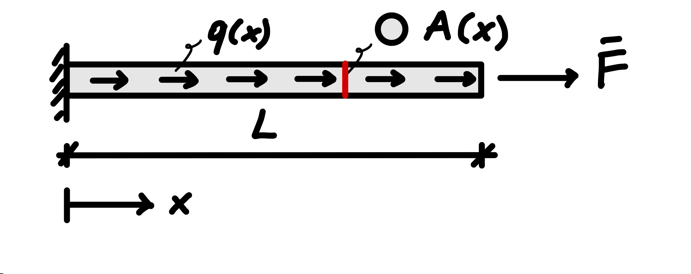

# The weak form of the one-dimensional axial bar

Part II introduced the finite element assembly process through discrete spring
systems. For those systems, the element force--displacement relations followed
directly from spring kinematics, the constitutive law, and equilibrium. Part III
moves to continuum problems, where the unknown is a field governed by a
differential equation. Before the familiar finite element assembly process can
be used, the continuum problem must therefore be reformulated in a form suitable
for numerical approximation.

The familiar algebraic system $\mathbf{K}\mathbf{u}=\mathbf{f}$ will eventually
reappear, but the path to it is now different: the governing differential
equation is first reformulated in weak form and only then restricted to a
finite-dimensional approximation. This formulation provides a systematic basis
for handling spatially varying properties, distributed loads, natural boundary
conditions, and finite element approximations of different orders. It therefore
provides the bridge between the continuum model and the finite element equations
that will ultimately be assembled.

## From three-dimensional equilibrium to a one-dimensional model

In a general three-dimensional continuum, whether the deformation is small or
finite and whether the material response is linear or nonlinear, the
quasi-static equilibrium equation in the current configuration can be written as
$$
  \nabla\cdot\boldsymbol{\sigma}+\mathbf{b}=\mathbf{0},
$$

where $\boldsymbol{\sigma}$ is the Cauchy stress tensor and $\mathbf{b}$ is the
body-force vector per unit current volume. The assumptions of small deformation
and linear elasticity will be introduced later through the kinematic and
constitutive relations. Throughout this book, the first stress index identifies
the normal to the plane on which the stress acts, while the second identifies
the direction of the stress component. With this convention, the Cartesian
equilibrium equations are
$$
  \begin{aligned}
  \frac{\partial \sigma_{xx}}{\partial x}
  +\frac{\partial \sigma_{yx}}{\partial y}
  +\frac{\partial \sigma_{zx}}{\partial z}
  +b_x &= 0,\\[4pt]
  \frac{\partial \sigma_{xy}}{\partial x}
  +\frac{\partial \sigma_{yy}}{\partial y}
  +\frac{\partial \sigma_{zy}}{\partial z}
  +b_y &= 0,\\[4pt]
  \frac{\partial \sigma_{xz}}{\partial x}
  +\frac{\partial \sigma_{yz}}{\partial y}
  +\frac{\partial \sigma_{zz}}{\partial z}
  +b_z &= 0.
  \end{aligned}
$$
For the continuum model considered here, balance of angular momentum implies
that the Cauchy stress tensor is symmetric
($\boldsymbol{\sigma}=\boldsymbol{\sigma}^{\mathsf T}$ or
$\sigma_{ij}=\sigma_{ji}$). Together with kinematic relations, a constitutive
law, and appropriate boundary conditions, the equilibrium equations define a
boundary-value problem.

We now introduce a one-dimensional idealization of a slender three-dimensional
body: the axial bar model. The bar is assumed to be slender, aligned with the
$x$ axis, and subjected to axial loading, as shown in
@fig-bar-1d-boundary-value-problem. Its deformation is described by an axial
displacement field $u(x)$, while the stress distribution over each cross-section
is represented by the axial resultant $N(x)$.

{
  #fig-bar-1d-boundary-value-problem
  width=30%
}

As discussed in @sec-discrete-continuous, the one-dimensional bar model is based
on a kinematic idealization: only the axial displacement is retained, and it is
assumed to be uniform over each cross-section and to vary only along the bar
axis. Lateral deformation, including effects such as Poisson contraction, is not
represented by the one-dimensional model. The displacement field is therefore
described by the scalar function

$$
  u=u(x).
$$

Under the small-strain assumption, the axial strain retained by the model is

$$
  \varepsilon(x)
  =
  \varepsilon_{xx}(x)
  =
  \frac{du}{dx}
  =
  u'(x).
$$

For a linearly elastic material,

$$
  \sigma(x)=E(x)\varepsilon(x).
$$

The internal axial force is obtained by integrating the axial stress over the
cross-section,

$$
  N(x)=\int_{A(x)} \sigma\,dA.
$$

For the one-dimensional bar model, the axial stress is assumed to be uniform
over each cross-section. The resultant therefore reduces to

$$
  N(x)=A(x)\sigma(x).
$$

Using the linear elastic constitutive relation $\sigma(x)=E(x)\varepsilon(x)$
together with $\varepsilon(x)=u'(x)$ gives

$$
  \boxed{
  N(x)=E(x)A(x)u'(x)
  }.
$$

Correspondingly, the distributed axial load $q(x)$ represents the external load
resultant per unit length of the bar. It may include contributions from body
forces acting over the cross-section and from tractions applied to the lateral
surface. We may therefore write

$$
  q(x)
  =
  \int_{A(x)} b_x\,dA
  +
  q_s(x),
$$

where $q_s(x)$ denotes the axial load per unit length resulting from lateral
surface tractions.

If the body-force density $b_x(x)$ is uniform over the cross-section and no
lateral traction is present, this reduces to

$$
  q(x)=A(x)b_x(x).
$$

Loads applied to the end cross-sections are treated separately as boundary
forces.

## Equilibrium and the strong form

Consider the equilibrium of an infinitesimal segment of the bar.

{
  #fig-bar-1d-infinitesimal-equilibrium
  width=39%
}

The quantity $q(x)\,dx$ shown in @fig-bar-1d-infinitesimal-equilibrium
represents the leading-order resultant of the distributed load over the
infinitesimal segment. In the equilibrium equation below, we retain the exact
resultant $\int_x^{x+dx}q(s)\,ds$ before taking the limit $dx\to0$.

We take $N>0$ in tension and $q>0$ when the distributed load acts in the
positive $x$ direction. With this sign convention, axial force equilibrium over
the segment $[x,x+dx]$ gives

$$
  -N(x)+N(x+dx)+\int_x^{x+dx} q(s)\,ds=0.
$$

Dividing by $dx$,

$$
  \frac{N(x+dx)-N(x)}{dx}
  +
  \frac{1}{dx}\int_x^{x+dx} q(s)\,ds
  =0.
$$

Taking the limit as $dx\to0$ gives the local equilibrium equation

$$
  \boxed{
  \frac{dN}{dx}+q=0
  }.
$$

Using

$$
  N(x)=E(x)A(x)u'(x),
$$

we obtain the governing differential equation

$$
  \boxed{
  \frac{d}{dx}\left(EA\,u'\right)+q=0
  \qquad \text{in }\Omega=(0,L).
  }
$$

This form remains valid when $E$, $A$, or both vary along the bar. Only when
$EA$ is constant can it be reduced to

$$
  EA\,u''+q=0 \qquad \text{in }\Omega=(0,L).
$$

::: {.callout-note title="Elliptic character of the bar problem"}
The governing bar equation is the one-dimensional counterpart of the elliptic
equations that arise in static elasticity.

In two and three dimensions, combining equilibrium, kinematics, and a stable
elastic constitutive law leads to a coupled system of second-order elliptic
partial differential equations for the displacement field. In the present
one-dimensional setting, the corresponding problem reduces to a second-order
ordinary differential equation.

For positive axial rigidity $E(x)A(x)>0$ throughout the bar, the differential
operator
$$
  -\frac{d}{dx}
  \left(
  EA\,\frac{d}{dx}
  \right)
$$

is the one-dimensional analogue of an elliptic operator.
:::

A differential equation alone does not define the problem completely. Boundary
conditions are also required.

For the bar considered here, the left end is fixed,

$$
  u(0)=0,
$$

while the axial force prescribed at the right end is

$$
  N(L)=E(L)A(L)u'(L)=\bar F,
$$

with $\bar F>0$ acting in the positive $x$ direction.

The displacement condition is a **Dirichlet**, or **essential**, boundary
condition. The force condition is a **Neumann**, or **natural**, boundary
condition.

In general, the boundary $\Gamma$ is partitioned into a displacement part
$\Gamma_u$ and a traction part $\Gamma_t$. For the present one-dimensional
problem,

$$
  \Gamma_u=\{0\},
  \qquad
  \Gamma_t=\{L\}.
$$

The prescribed displacement on $\Gamma_u$ is $u=0$, while the prescribed
traction resultant on $\Gamma_t$ is $N=\bar F$.

The governing differential equation, together with the associated boundary
conditions, constitutes the **strong form** of the boundary-value problem.

## Why introduce a weak form?

The strong form imposes the governing differential equation pointwise and
therefore places relatively strong smoothness requirements on the displacement
field.

As an example, consider a perfectly bonded bar made of two materials. If the
axial rigidity $EA$ changes abruptly across the material interface, equilibrium
requires the axial force

$$
  N=EA\,u'
$$

to remain continuous in the absence of an interface load. Because perfect
bonding also requires the displacement $u$ to remain continuous, a nonzero
transmitted axial force produces different displacement gradients on the two
sides of the interface whenever the values of $EA$ differ. Thus, $u$ remains
continuous while $u'$ is generally discontinuous across the interface, as
illustrated in @fig-bar-1d-bimaterial-displacement-gradient.

{
  #fig-bar-1d-bimaterial-displacement-gradient
  width=36%
}

The appropriate divergence form of the equilibrium equation is

$$
  \frac{d}{dx}\left(EA\,u'\right)+q=0,
$$

rather than the expanded form $EA\,u''+q=0$, which is valid only where $EA$ is
constant.

In this example, the physical equilibrium condition remains perfectly valid: the
axial force $N=EA\,u'$ is continuous across the interface. What changes is the
regularity of the displacement field. Because $u'$ is discontinuous across the
material interface, the displacement field $u$ does not have a classical second
derivative at the interface.

The difficulty is therefore related to the smoothness required to enforce the
strong form pointwise. A weak formulation expresses the same equilibrium problem
while requiring fewer derivatives of the displacement field. As we will see
shortly, equilibrium is no longer enforced pointwise; instead, it is imposed in
a weighted, integral sense over the domain. In the standard displacement-based
finite element formulation used here, this allows the displacement approximation
to remain continuous while its derivatives may be discontinuous across material
interfaces or element boundaries. The first step toward this formulation is to
replace pointwise enforcement of the differential equation by a weighted
integral statement.

## The weighted residual statement

Define the residual of the governing equation as

$$
  r(u)
  =
  \frac{d}{dx}\left(EA\,u'\right)+q.
$$

The strong form requires

$$
  r(u)=0
  \qquad
  \text{at every point in }\Omega.
$$

Rather than requiring the strong form to hold pointwise, we introduce a test, or
weight, function $w(x)$ and require the weighted residual to vanish for every
admissible test function:
$$
  \boxed{
  \int_0^L w\,r(u)\,dx=0
  \qquad
  \forall\,w\in V.
  }
$$

Here, admissible means that the function has the regularity required by the
formulation and satisfies the relevant essential boundary conditions; the
precise test space will be defined below.

::: {.callout-note title="Trial, test, and admissible functions"}
The **trial field** is a candidate for the unknown displacement field $u$.

A **test function**, also called a **weight function**, is used to test the
equilibrium statement through the weighted residual or weak form.

A function is **admissible** when it has the required regularity and satisfies
the appropriate essential boundary conditions. For trial fields this means
$u=\bar u$ on $\Gamma_u$, where $\bar u$ denotes the prescribed displacement;
for test functions it means the corresponding homogeneous condition $w=0$ on
$\Gamma_u$.

The same test function $w$ appearing in the weighted residual statement may also
be interpreted as an **admissible variation** of the displacement field: a
perturbation that does not violate the prescribed displacement.

More specifically, let $u$ be an admissible displacement field satisfying

$$
  u=\bar u
  \qquad \text{on }\Gamma_u.
$$

A perturbed field can be written as

$$
  u+\eta w,
$$

where $\eta$ is an arbitrary scalar. For the perturbed field to satisfy the same
prescribed displacement, we must also have

$$
  u+\eta w=\bar u
  \qquad \text{on }\Gamma_u.
$$

Since $u=\bar u$ on $\Gamma_u$, this condition reduces to

$$
  \eta w=0
  \qquad \text{on }\Gamma_u.
$$

Because $\eta$ is arbitrary, the test function must therefore satisfy

$$
  w=0
  \qquad \text{on }\Gamma_u.
$$

Thus, trial fields satisfy the prescribed essential boundary condition, whereas
test functions satisfy the corresponding homogeneous condition.
:::

Here $V$ denotes the set of admissible test functions; it will be defined
precisely below. For the axial bar,

$$
  \int_0^L
  w
  \left[
  \frac{d}{dx}\left(EA\,u'\right)+q
  \right]
  dx
  =0
  \qquad
  \forall\,w\in V.
$$

It is not enough for one weighted average of the residual to vanish. The
integral relation must hold for every admissible test function. Before
discretization, this is still an infinite family of conditions.

At this stage the derivative order acting on $u$ has not changed. The next step
is what makes the formulation useful for standard displacement-based finite
elements.

## Integration by parts

Integration by parts transfers one derivative from the equilibrium term to the
test function:

$$
  \int_0^L
  w\,\frac{d}{dx}\left(EA\,u'\right)dx
  =
  \left[wEAu'\right]_0^L
  -
  \int_0^L
  w'EAu'\,dx.
$$

The weighted residual statement therefore becomes

$$
  -\int_0^L
  w'EAu'\,dx
  +
  \int_0^L
  wq\,dx
  +
  \left[wEAu'\right]_0^L
  =0,
$$

or, equivalently,

$$
  \int_0^L
  w'EAu'\,dx
  =
  \int_0^L
  wq\,dx
  +
  \left[wEAu'\right]_0^L.
$$

This step has two consequences that are central to the finite element method:

1. the highest derivative acting on the displacement field has been reduced from
   second order to first order;
2. the boundary-force contribution has appeared explicitly.

No finite element approximation has yet been introduced: the weighted residual
statement and the integration-by-parts step reformulate the continuum problem
before any discretization is chosen.

## Essential and natural boundary conditions

The trial displacement field must satisfy the prescribed displacement condition

$$
  u(0)=0.
$$

Test functions represent admissible variations of the trial field. They must
therefore leave the prescribed displacement unchanged and satisfy the
corresponding homogeneous condition. For the present problem,

$$
  w(0)=0.
$$

The boundary term generated by integration by parts then becomes

$$
  \left[wEAu'\right]_0^L
  =
  w(L)EAu'(L)-w(0)EAu'(0)
  =
  w(L)EAu'(L).
$$

Using the prescribed axial force

$$
  E(L)A(L)u'(L)=\bar F,
$$

we obtain

$$
  \boxed{
  \int_0^L
  w'EAu'\,dx
  =
  \int_0^L
  wq\,dx
  +
  w(L)\bar F
  \qquad
  \forall\,w\in V.
  }
$$

The distinction between the two boundary-condition types is now explicit. The
essential condition constrains the admissible displacement field and therefore
the admissible test functions. The natural condition enters the formulation
through the boundary term generated by integration by parts.

This distinction also explains the terminology: essential conditions must be
imposed on the admissible displacement space, whereas natural conditions arise
naturally through the boundary term of the weak formulation.

## Regularity and admissible functions

The strong form requires the differential equation to hold pointwise. In a
region where $EA$ is differentiable and $u$ is twice differentiable, the product
rule gives

$$
  (EA)'u' + EA\,u'' + q = 0,
$$

which explicitly involves the second derivative of the displacement. More
generally, a classical strong formulation requires $(EAu')'$ to exist pointwise.
After integration by parts, the weak form contains only first derivatives of the
trial and test functions.

For the present problem, the natural regularity space is the Sobolev space
$H^1(\Omega)$. Informally, a function belongs to $H^1(\Omega)$ when both the
function and its first weak derivative are square integrable. For the
displacement field, with $u'$ understood in the weak sense, this means

$$
  \int_\Omega
  \left(
  u^2+(u')^2
  \right)dx
  <\infty.
$$

A weak derivative generalizes the classical derivative by allowing
differentiation to be defined in an integral sense rather than pointwise
everywhere. This is important for finite elements: a continuous piecewise-linear
displacement field belongs to $H^1(\Omega)$ even though its derivative may jump
at element boundaries.

::: {.callout-note title="What is a weak derivative?"}
A classical derivative is defined pointwise. At a point where the slope is
discontinuous, the classical derivative does not exist.

A weak derivative is defined instead through an integral relation. A function
$g$ is the weak derivative of $u$ if

$$
  \int_\Omega u\,\varphi'\,dx
  =
  -\int_\Omega g\,\varphi\,dx
$$

for every smooth auxiliary function $\varphi$ with compact support in $\Omega$,
meaning that $\varphi$ vanishes in a neighborhood of the boundary.

The function $\varphi$ used here is only an auxiliary function in the definition
of the weak derivative; it should not be confused with the finite element test
function $w$ used in the weak formulation.

Consider a continuous piecewise-linear function with an interior point $x_i$:

$$
  u(x)=
  \begin{cases}
  a_1x+b_1, & x<x_i,\\
  a_2x+b_2, & x>x_i
  \end{cases}
$$

with the coefficients chosen so that the two branches meet continuously at
$x_i$:

$$
  a_1x_i+b_1=a_2x_i+b_2.
$$

If $a_1\neq a_2$, the classical derivative is not defined at $x_i$. Away from
that point,

$$
  g(x)=
  \begin{cases}
  a_1, & x<x_i,\\
  a_2, & x>x_i.
  \end{cases}
$$

This piecewise-constant function is nevertheless the weak derivative of $u$. The
value assigned to the derivative at the single point $x_i$ does not affect the
integrals appearing in the weak formulation.

This is why a continuous finite element displacement field may belong to
$H^1(\Omega)$ even though its derivative is discontinuous at element boundaries.
:::

The standard displacement-based finite element approximations considered here
are constructed to satisfy $C^0$ continuity as the minimum interelement
continuity requirement: the displacement field itself is continuous across
element boundaries, whereas continuity of its derivatives is not imposed.

The superscript $h$ will denote quantities associated with the
finite-dimensional discretization. The symbol $h$ is conventionally related to a
characteristic element size; its precise meaning will become clear once the bar
is partitioned into finite elements.

Thus,

$$
  u^h\in C^0(\Omega),
$$

while

$$
  \frac{du^h}{dx}
$$

may be discontinuous from one element to the next. As will be shown later, the
weak form therefore admits the $C^0$ piecewise-polynomial displacement fields
used in standard finite elements, without requiring a classical second
derivative to exist at element boundaries.

We can now define the admissible trial and test sets precisely. For the present
problem, the prescribed displacement is homogeneous, so

$$
  S=
  \left\{
  u\in H^1(\Omega):
  u=0\text{ on }\Gamma_u
  \right\},
$$

while

$$
  V=
  \left\{
  w\in H^1(\Omega):
  w=0\text{ on }\Gamma_u
  \right\}.
$$

More generally, if a nonzero displacement $u=\bar u$ is prescribed on
$\Gamma_u$, the trial set becomes

$$
  S=
  \left\{
  u\in H^1(\Omega):
  u=\bar u\text{ on }\Gamma_u
  \right\},
$$

while the test space $V$ contains the corresponding homogeneous variations.

## The weak form

Define the bilinear form

$$
  a(w,u)
  =
  \int_0^L
  w'EAu'\,dx
$$

and the linear form

$$
  \ell(w)
  =
  \int_0^L
  wq\,dx
  +
  w(L)\bar F.
$$

The weak problem is therefore

$$
  \boxed{
  \text{Find }u\in S
  \text{ such that }
  a(w,u)=\ell(w)
  \qquad
  \forall\,w\in V.
  }
$$

The weak form expresses the same equilibrium problem as the strong form, but
with lower regularity requirements. The natural boundary condition enters
naturally through the load functional, or linear functional, $\ell(w)$.

## From the weak problem to a finite-dimensional problem

The weak problem is still infinite-dimensional because the admissible trial and
test sets contain infinitely many functions.

The conforming finite element method used here replaces these sets by
finite-dimensional approximations,

$$
  S^h\subset S,
  \qquad
  V^h\subset V.
$$

Informally, a finite-dimensional approximation is described by a finite number
of coefficients. For the present bar problem, whose prescribed displacement is
zero, the approximate displacement can be written as

$$
  u^h(x)
  =
  \sum_{i=1}^{n} c_i\,\phi_i(x),
$$

where the finite set of functions $\phi_i(x)$ defines the approximation and the
coefficients $c_i$ are the unknowns.

For nonhomogeneous essential boundary conditions, the approximate field is
written as the sum of a part satisfying the prescribed displacement and a
homogeneous expansion for the remaining unknown part.

The choice of the functions $\phi_i$ is part of the approximation. In the finite
element method, they are typically constructed from piecewise polynomials
defined over the elements. Other numerical methods may use different
finite-dimensional spaces, for example spaces generated by trigonometric
functions or global polynomials.

The finite-dimensional weak problem is obtained by seeking

$$
  u^h\in S^h
$$

such that

$$
  a(w^h,u^h)=\ell(w^h)
  \qquad
  \forall\,w^h\in V^h.
$$

This is a Galerkin approximation. In the standard displacement-based finite
element method used here, the trial and test functions are constructed from the
same finite-dimensional family of basis functions, after accounting for the
essential boundary conditions. This choice is known as the **Bubnov--Galerkin
method**.

Other formulations may use different approximation spaces for the trial and test
functions; these are generally referred to as **Petrov--Galerkin methods**.

The remaining question is how those finite-dimensional spaces should be
constructed so that the weak problem becomes a computable finite element model.
