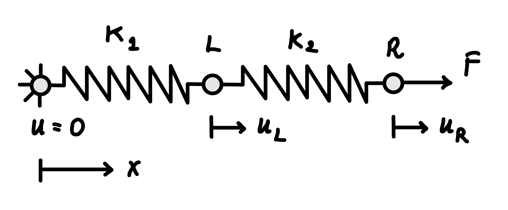
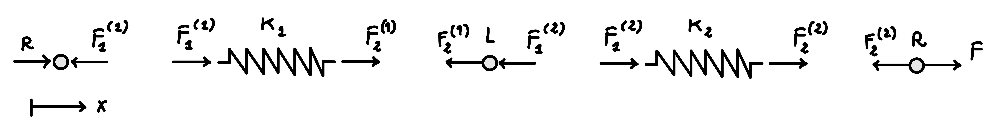

# Two springs in series: the direct stiffness method {#sec-two-springs-theory}

We begin with the physical system shown in @fig-carts-springs: two carts
connected in series by linear springs, with the left end fixed and a force $F$
applied to the right cart.

{
#fig-carts-springs
width=36%
}

To analyse the system, we first construct an idealised mechanical model. The
motion is restricted to one dimension, the carts are treated as rigid bodies
that can translate only in the $x$ direction, and the springs are assumed to be
massless and linearly elastic. The problem is quasi-static and the carts are
frictionless.

In this one-dimensional model, shown in @fig-carts-springs-model, the spring end
points and their connections to the carts and support are represented by
**nodes**. Each spring connects two nodes and forms an **element** of the model.
The displacement of a node in the $x$ direction is a **degree of freedom**. The
complete mechanical system can therefore be described by its nodes, spring
elements, nodal displacements, applied forces, and displacement constraints.

{
#fig-carts-springs-model
width=36%
}

The objective is to determine the displacements of the two carts. We first solve
the problem directly from equilibrium, providing an independent reference
solution. We then obtain the same result using the direct stiffness method.

For the numerical example we define

$$
  k_1=1\ \mathrm{N/mm},
  \qquad
  k_2=2\ \mathrm{N/mm},
  \qquad
  F=10\ \mathrm{N}.
$$

These values are chosen to keep the arithmetic simple while producing
displacements that are easy to interpret physically.

## Learning objectives

After completing this chapter, you should be able to:

- derive the stiffness relation for a one-dimensional spring;
- formulate and assemble the global stiffness system for a spring model;
- apply displacement boundary conditions and solve for the unknown nodal
  displacements;
- recover and verify quantities such as spring forces and reactions.

## Solution using equilibrium

### Direct equilibrium solution {#sec-direct-equilibrium-solution}

Before introducing the direct stiffness method, we solve the problem directly
from mechanical equilibrium. This provides an independent solution against which
the stiffness-method result can later be checked.

For this derivation, let $u_L$ and $u_R$ denote the displacements of the left
and right carts, respectively. We denote the scalar internal force in spring $e$
by $F_s^{(e)}$, where the superscript identifies the spring. A positive value of
$F_s^{(e)}$ denotes tension.

The geometric displacement notation used here is limited to the equilibrium
solution; a separate global node numbering is introduced later.

{
  #fig-cart-spring-model-free-body
  width=93%
}

Because the system is in static equilibrium, the net force acting on each cart
must be zero.

Consider first the right cart. The applied force $F$ must be balanced by the
force transmitted by spring 2. Therefore,

$$
  F_s^{(2)}=F.
$$

Equilibrium of the left cart requires the forces transmitted by the two springs
to be equal. Hence,

$$
  F_s^{(1)}=F_s^{(2)}=F.
$$

Both springs therefore carry the same internal force $F$, as expected for two
springs connected in series.

From the spring relation

$$
  F_s=k_s\delta,
$$

the elongations of the two springs are

$$
  \delta_1=\frac{F}{k_1},
  \qquad
  \delta_2=\frac{F}{k_2}.
$$

The left end of spring 1 is fixed, so its elongation is equal to the
displacement of the left cart:

$$
  u_L=\delta_1=\frac{F}{k_1}.
$$

The elongation of spring 2 is the relative displacement of its two ends,

$$
  \delta_2=u_R-u_L.
$$

Therefore,

$$
  u_R=u_L+\delta_2
  =\frac{F}{k_1}+\frac{F}{k_2}.
$$

For the numerical data,

$$
  u_L=10\ \mathrm{mm},
  \qquad
  u_R=15\ \mathrm{mm}.
$$

Finally, equilibrium of the complete system gives the support reaction

$$
  R=-F=-10\ \mathrm{N}.
$$

The negative sign indicates that the reaction acts opposite to the positive $x$
direction.

::: {.callout-note title="Are these values realistic?"}
The numerical values are representative of a small tabletop experiment rather
than a structural component.

- A load of $10\ \mathrm{N}$ is approximately the weight of a $1\ \mathrm{kg}$
  mass under gravity.
- A spring stiffness of $1\ \mathrm{N/mm}$ means that the spring extends by
  $1\ \mathrm{mm}$ for each newton of applied force.
- A spring stiffness of $2\ \mathrm{N/mm}$ means that the spring extends by
  $0.5\ \mathrm{mm}$ for each newton of applied force.

Under the applied load, the two springs in series extend by

$$
  u_R=10\left(\frac{1}{1}+\frac{1}{2}\right)=15\ \mathrm{mm}.
$$

The right cart therefore moves by $15\ \mathrm{mm}$, while the extension of the
second spring is

$$
  u_R-u_L=5\ \mathrm{mm}.
$$

These displacements are deliberately large enough to be visible and measurable
in a simple laboratory demonstration.
:::

::: {.callout-note title="Independent checks"}
The solution should be checked independently whenever possible.

**Dimensional consistency.** Because stiffness has units of force divided by
length, $F/k$ has units of displacement.

**Equivalent stiffness.** For two springs in series,

$$
  \frac{1}{k_{\mathrm{eq}}}
  =
  \frac{1}{k_1}+\frac{1}{k_2},
$$

so that $u_R=F/k_{\mathrm{eq}}$.

**Limiting cases.** If $k_1\to\infty$, spring 1 becomes rigid and $u_L\to0$. If
$k_2\to\infty$, spring 2 becomes rigid and both carts move together, with
$u_R=u_L=F/k_1$.

**Equivalence to other mechanical elements.** For axial deformation, a uniform
rod behaves like a linear spring with stiffness $k_s=EA/L$, and the displacement
of a uniform rod fixed at one end and loaded axially by $F$ at the other is
$FL/EA$. Substituting the spring stiffness

$$
  k_s = \frac{EA}{L}
$$

into the spring displacement expression,

$$
  u = \frac{F}{k_s},
$$

gives

$$
  u
  = \frac{F}{EA/L}
  = \frac{FL}{EA},
$$

which agrees with the expression of the axial displacement of a uniform rod.
:::

### Systematic equilibrium formulation

The equilibrium solution above used the fact that two springs in series carry
the same internal force. We now formulate the same mechanical problem in a more
systematic way by treating the spring-end forces, the support reaction, and the
cart displacements as unknown quantities.

For the complete assembly to be in equilibrium, each spring and each cart must
satisfy equilibrium. The support reaction enters as the unknown force applied at
the fixed end, while the complete assembly must also satisfy global force
balance. At the same time, the two springs are connected through the carts, so
all spring ends attached to the same cart must share the same displacement. This
enforces kinematic compatibility. Together with the force--displacement relation
of each spring, these conditions provide a complete set of algebraic equations
for the mechanical system. Rather than solving simultaneously for every force
and displacement, we will use this formulation to show how the nodal
displacements can be selected as the primary unknowns and the remaining
quantities recovered afterwards. The direct stiffness method will then reproduce
the same displacement system from the element stiffness relations, connectivity,
and equilibrium at the global nodes.

To formulate equilibrium systematically, we now distinguish the forces acting at
the two ends of each spring. We denote by $F_i^{(e)}$ the signed nodal force
acting on spring $e$ at local end $i$, referred to the positive $x$ direction.
The superscript identifies the spring, whereas the subscript identifies the
local spring end. For both springs, local end 1 is the left end and local end 2
is the right end.

{
#fig-cart-spring-model-signed-free-body
width=93%
}

At the fixed left end of spring 1, the corresponding nodal force $F_1^{(1)}$ is
the support reaction $R$.

Spring 1 has end displacements $0$ and $u_L$. Its elongation is therefore

$$
  \delta_1=u_L,
$$

and its internal force is

$$
  F_s^{(1)}=k_1u_L.
$$

The signed nodal forces associated with its two ends are therefore

$$
  R=-F_s^{(1)}=-k_1u_L,
  \qquad
  F_2^{(1)}=F_s^{(1)}=k_1u_L.
$$

Spring 2 has end displacements $u_L$ and $u_R$, so its elongation is

$$
  \delta_2=u_R-u_L,
$$

and its internal force is

$$
  F_s^{(2)}=k_2(u_R-u_L).
$$

Equilibrium of the two ends of spring 2 gives

$$
  F_1^{(2)}=-F_s^{(2)}
  =k_2u_L-k_2u_R,
$$

and

$$
  F_2^{(2)}=F_s^{(2)}
  =-k_2u_L+k_2u_R.
$$

We now impose equilibrium of the carts. By action and reaction, the forces
exerted by the springs on the carts are opposite to the corresponding spring-end
nodal forces defined above. This implies

- for the left cart,
  $-F_2^{(1)}-F_1^{(2)}=0, \quad \mathrm{or,\ equivalently,} \quad F_2^{(1)}+F_1^{(2)}=0;$

- for the right cart,
  $-F_2^{(2)}+F=0, \quad \mathrm{and\ therefore} \quad F_2^{(2)}=F.$

The prescribed zero displacement at the fixed support has already been used in
the relation for spring 1. Once $u_L$ has been determined, the support reaction
can be recovered from

$$
  R=-k_1u_L=-F_2^{(1)}.
$$

Equilibrium of the complete assembly also gives

$$
  R+F=0.
$$

However, this equation is dependent on the others: it follows from the spring
relations together with equilibrium of the two carts.

After substituting the two internal-force expressions, the spring-end force
relations provide four scalar equations, equilibrium of the two carts provides
two more, and equilibrium of the complete assembly provides one. Of these seven
scalar relations, one is redundant. We are, therefore, left with six independent
equations in the six unknowns

$$
  u_L,\qquad u_R,\qquad R,\qquad
  F_2^{(1)},\qquad F_1^{(2)},\qquad F_2^{(2)}.
$$

All six unknowns could be determined simultaneously. However, in a
displacement-based formulation we choose the nodal displacements as the primary
unknowns. The spring-end forces and the support reaction can then be recovered
from the displacements after the solution has been obtained. Eliminating the
spring-end forces from the cart-equilibrium equations gives

$$
  \begin{bmatrix}
  k_1+k_2 & -k_2\\
  -k_2 & k_2
  \end{bmatrix}
  \begin{bmatrix}
  u_L\\u_R
  \end{bmatrix}
  =
  \begin{bmatrix}
  0\\F
  \end{bmatrix}.
$$

Solving this system yields the same displacements obtained from the direct
equilibrium argument above. More importantly, this is the displacement system
that the direct stiffness method will reproduce systematically by combining the
element stiffness relations according to the model connectivity and enforcing
equilibrium at the global nodes.

## Solution using the direct stiffness method

The systematic equilibrium formulation discussed above produced a displacement
system by writing the spring relations, enforcing equilibrium, and eliminating
the spring-end forces. The direct stiffness method organizes these same
mechanical operations into a standard procedure that can be applied
systematically to larger assemblies and automated.

The method constructs the global system of equations

$$
  \mathbf{K}\mathbf{u}=\mathbf{f}
$$

from the stiffness relations of the individual elements and their connectivity.
We begin by deriving the nodal force--displacement relation for a single spring.

### Nodal equilibrium relation for a spring

Consider a spring of stiffness $k_s$ connecting nodes $a$ and $b$, as shown in
@fig-spring-1d-element. The nodal displacements $u_a$ and $u_b$ are measured
along the $x$ direction, while $F_a$ and $F_b$ denote the corresponding nodal
force components acting on the spring, taken as positive in the positive $x$
direction.

{
  #fig-spring-1d-element
  width=27%
}

From the previous chapter, the internal spring force is

$$
  F_s=k_s(u_b-u_a),
$$

where $F_s>0$ denotes tension.

The nodal-force convention and the internal-force convention describe different
signed quantities. The nodal forces $F_a$ and $F_b$ act on the spring and are
referred to the positive global $x$ direction, whereas $F_s>0$ denotes internal
tension. The nodal forces required to equilibrate a spring in tension therefore
have the pattern $[-F_s,\ F_s]^{\mathsf T}$.

To express equilibrium, cut the spring and consider the two separated parts
shown in @fig-spring-1d-cut.

{
  #fig-spring-1d-cut
  width=45%
}

Equilibrium of the two parts gives

$$
  \begin{cases}
  F_a+F_s=0,\\
  -F_s+F_b=0.
  \end{cases}
$$

Substituting $F_s=k_s(u_b-u_a)$ yields

$$
  \begin{cases}
  k_su_a-k_su_b=F_a,\\
  -k_su_a+k_su_b=F_b,
  \end{cases}
$$

which can be written in matrix form as

$$
  \underbrace{
  k_s
  \begin{bmatrix}
  1 & -1\\
  -1 & 1
  \end{bmatrix}
  }_{\mathbf{K}_s}
  \underbrace{
  \begin{bmatrix}
  u_a\\u_b
  \end{bmatrix}
  }_{\mathbf{u}_s}
  =
  \underbrace{
  \begin{bmatrix}
  F_a\\F_b
  \end{bmatrix}
  }_{\mathbf{f}_s}.
$$

Here, $\mathbf{u}_s$ is the vector of nodal displacements, $\mathbf{f}_s$ is the
vector of nodal forces, and $\mathbf{K}_s$ is the spring stiffness matrix.

### Pre-processing: nodes, elements, and model data

In this example, the mechanical system is already discrete. The pre-processing
step therefore consists of describing it in the form required by the direct
stiffness method: defining the nodes and elements, their connectivity and
properties, and the applied loads and displacement constraints.

We use one spring element for each physical spring and one node at each distinct
connection point between the springs, carts, and support. The model therefore
contains three nodes and two elements. Node and element labels are identifiers;
they do not need to follow the geometric order. To make this independence
explicit, use the global node numbering shown in @fig-spring-cart-fem-model.

{
  #fig-spring-cart-fem-model
  width=99%
}

The connectivity of an element specifies how its local nodes are associated with
the global nodes of the model. The ordering of the local nodes also defines the
local direction of the element, taken here from local node 1 to local node 2.
For a two-node spring element, the connectivity therefore consists of the two
global node numbers corresponding to local nodes 1 and 2.

With reference to @fig-spring-cart-fem-model, the connectivity for this model is
summarised in the table below:

  | element number | global node corresponding to local node 1 | global node corresponding to local node 2 |
  | -------------: | ----------------------------------------: | ----------------------------------------: |
  |              1 |                                         2 |                                         3 |
  |              2 |                                         3 |                                         1 |

The spring stiffness is supplied directly as an element property. The element
stiffness data are

  | element number | spring stiffness assigned to the element |
  | -------------: | :--------------------------------------- |
  |              1 | $k_1=1\ \mathrm{N/mm}$                   |
  |              2 | $k_2=2\ \mathrm{N/mm}$                   |

In general, $k_e$ denotes the stiffness assigned to element $e$; for this model,
the two values are $k_1$ and $k_2$.

The nodal coordinates describe the geometry of the model. Because the spring
stiffness $k_e$ is supplied directly, the nodal coordinates do not enter the
element stiffness calculation in this example. They remain useful for describing
and plotting the model.

::: {.callout-important title="Consistent systems of units"}
All quantities must be expressed in a consistent system of units. This
requirement applies even though the matrices in this example are initially
written symbolically and can be solved by hand. In larger systems, numerical
values are normally supplied to linear-algebra software, which usually stores
matrix entries as numbers without interpreting their physical units. The input
values must therefore already belong to one coherent system of units.

Here, forces are expressed in newtons, displacements in millimetres, spring
stiffnesses in newtons per millimetre, and strain energy in newton millimetres.
With these choices, solving the numerical system returns displacements in
millimetres. For the same reason, a bar element with axial stiffness $EA/L$
would require Young's modulus $E$ in newtons per square millimetre, the
cross-sectional area $A$ in square millimetres, and the bar length $L$ in
millimetres.

Alternatively, forces may be expressed in newtons and lengths in metres. In that
case, spring stiffnesses must be expressed in newtons per metre, $E$ in newtons
per square metre, $A$ in square metres, and the computed displacements will be
in metres. Any consistent system of units may be used, but all input quantities
must be expressed using the same system.
:::

### Degrees of freedom and global ordering

A degree of freedom is a scalar variable used to describe one component of the
possible motion of a node. A node and a degree of freedom are therefore distinct
concepts: a node identifies a point in the model, whereas a degree of freedom
describes one component of its motion.

In this one-dimensional spring model, each node has one axial displacement
degree of freedom. We choose the global degree-of-freedom numbering to coincide
with the global node numbering. Thus, node 1 carries degree of freedom 1, node 2
carries degree of freedom 2, and node 3 carries degree of freedom 3.

The global node ordering is summarised below.

  | global node number | physical location | global degree-of-freedom number | displacement variable |
  | -----------------: | :---------------- | ------------------------------: | :-------------------- |
  |                  1 | right cart        |                               1 | $u_1$                 |
  |                  2 | fixed left end    |                               2 | $u_2$                 |
  |                  3 | internal cart     |                               3 | $u_3$                 |

The global displacement vector follows numerical order, not geometric order:

$$
  \mathbf{u}=
  \begin{bmatrix}
  u_1\\u_2\\u_3
  \end{bmatrix}.
$$

The connectivity introduced previously maps local nodes to global nodes. For
assembly, we also need a local-to-global degree-of-freedom map, which identifies
where the local degrees of freedom of each element appear in the global
algebraic system.

  | element number | global degree of freedom corresponding to local degree of freedom 1 | global degree of freedom corresponding to local degree of freedom 2 |
  | -------------: | ------------------------------------------------------------------: | ------------------------------------------------------------------: |
  |              1 |                                                                   2 |                                                                   3 |
  |              2 |                                                                   3 |                                                                   1 |

Because there is exactly one degree of freedom per node and the
degree-of-freedom numbering has been chosen to match the node numbering, the
degree-of-freedom map contains the same numbers as the connectivity table. The
two maps nevertheless represent different information:

- the connectivity maps local nodes to global nodes;
- the degree-of-freedom map maps local element unknowns to positions in the
  global algebraic system.

A different degree-of-freedom numbering changes the ordering of the global
arrays but not the physical solution.

When a node carries more than one degree of freedom, node numbers and
degree-of-freedom numbers no longer have a one-to-one numerical correspondence.
For example, in two-dimensional elasticity each node typically carries two
displacement degrees of freedom, $u_x$ and $u_y$.

### Global equilibrium system

There are three global degrees of freedom, so the global displacement and force
vectors contain three entries and the global stiffness matrix has size
$3\times3$:
$$
  \mathbf{K}\in\mathbb{R}^{3\times3},
  \qquad
  \mathbf{u},\mathbf{f}\in\mathbb{R}^{3}.
$$

For each spring element $e$,
$$
  \mathbf{K}^{(e)}
  =
  k_e
  \begin{bmatrix}
  1 & -1\\
  -1 & 1
  \end{bmatrix}.
$$
Each element relation is written in terms of its two local degrees of freedom.
To obtain equilibrium equations for the complete model, the element
contributions must be expressed in the global degree-of-freedom ordering.

The local-to-global degree-of-freedom map tells us where the rows and columns of
each element stiffness matrix belong in the global matrix. If more than one
element contributes to the same global matrix entry, those contributions are
added. This process is called **assembly**.

The addition of contributions at shared degrees of freedom has a direct
mechanical meaning: it sums the signed element-end force contributions
associated with the same global degree of freedom. At an internal node with no
applied load, these contributions sum to zero. At a loaded or constrained node,
their sum equals the corresponding applied nodal load or reaction.

We now perform this operation explicitly for the two spring elements.

### Assembly of element 1

For element 1,

$$
  \mathbf{K}^{(1)}=
  k_1
  \begin{bmatrix}
  1 & -1\\
  -1 & 1
  \end{bmatrix},
$$

and the local-to-global map is

$$
  [1,2]_{\mathrm{local}}
  \longrightarrow
  [2,3]_{\mathrm{global}}.
$$

The four ordered local index pairs

$$
  (1,1),\ (1,2),\ (2,1),\ (2,2)
$$

map to the global positions

$$
  (2,2),\ (2,3),\ (3,2),\ (3,3).
$$

Thus,

$$
  \mathbf{K}_{\mathrm{from\ element\ 1}}=
  \begin{bmatrix}
  0 & 0 & 0\\
  0 & k_1 & -k_1\\
  0 & -k_1 & k_1
  \end{bmatrix}.
$$

{
  #fig-local-global-mapping
  width=99%
}

### Assembly of element 2

For element 2,

$$
  \mathbf{K}^{(2)}=
  k_2
  \begin{bmatrix}
  1 & -1\\
  -1 & 1
  \end{bmatrix},
$$

with

$$
  [1,2]_{\mathrm{local}}
  \longrightarrow
  [3,1]_{\mathrm{global}}.
$$

The four ordered local index pairs map to global positions

$$
  (3,3),\ (3,1),\ (1,3),\ (1,1).
$$

Therefore,

$$
  \mathbf{K}_{\mathrm{from\ element\ 2}}=
  \begin{bmatrix}
  k_2 & 0 & -k_2\\
  0 & 0 & 0\\
  -k_2 & 0 & k_2
  \end{bmatrix}.
$$

### Assembled stiffness matrix

Adding both element contributions gives

$$
  \mathbf{K}=
  \begin{bmatrix}
  k_2 & 0 & -k_2\\
  0 & k_1 & -k_1\\
  -k_2 & -k_1 & k_1+k_2
  \end{bmatrix}.
$$

The entry $K_{33}=k_1+k_2$ illustrates the essential assembly operation. Global
degree of freedom 3 is shared by both elements, so both spring stiffnesses
contribute to the equilibrium equation associated with that degree of freedom.

For $k_1=1\ \mathrm{N/mm}$ and $k_2=2\ \mathrm{N/mm}$,

$$
  \mathbf{K}=
  \begin{bmatrix}
  2 & 0 & -2\\
  0 & 1 & -1\\
  -2 & -1 & 3
  \end{bmatrix}
  \ \mathrm{N/mm}.
$$

Several properties can already be checked:

- the diagonal entries are positive for this connected spring assembly;

- the matrix is symmetric: $K_{ij}=K_{ji}$;

- $K_{12}=K_{21}=0$ because global degrees of freedom 1 and 2 do not belong to
  the same element;

- rigid translation is a null mode because
  $$
  \mathbf{K}
  \begin{bmatrix}
  1\\
  1\\
  1
  \end{bmatrix}
  =
  \mathbf{0},
  $$

  meaning that assigning the same displacement to every node does not deform
  either spring and therefore produces no internal forces;

- the matrix is singular before a displacement constraint is applied because the
  unconstrained assembly can translate without deforming either spring;

- for larger problems with local connectivity, the global matrix is sparse,
  meaning that many entries are zero.

### External forces, displacement constraint, and reaction

The vector of known applied nodal loads is

$$
  \mathbf{f}_{\mathrm{app}}=
  \begin{bmatrix}
  F\\0\\0
  \end{bmatrix}.
$$

The fixed left end imposes

$$
  u_2=0.
$$

The support reaction is unknown before the solution and is represented by

$$
  \mathbf{r}=
  \begin{bmatrix}
  0\\ R\\ 0
  \end{bmatrix}.
$$

The complete nodal equilibrium relation is therefore

$$
  \mathbf{K}\mathbf{u}
  =
  \mathbf{f}_{\mathrm{app}}+\mathbf{r}.
$$

Only the known applied load vector is used when solving for the unknown
displacements at the free degrees of freedom. The reaction is recovered
afterward from the original assembled system.

::: {.callout-note title="Displacement and force boundary conditions"}
A prescribed displacement is an essential, or Dirichlet, boundary condition. In
a continuum problem, a prescribed traction is a natural, or Neumann, boundary
condition. In the present discrete spring model, the corresponding quantity is a
prescribed nodal force.

In this discrete spring model, $u_2=0$ is a homogeneous displacement boundary
condition and $F$ is a prescribed nodal load. The support reaction $R$ is not a
prescribed load; it is an output recovered after the displacement solution has
been computed.
:::

### Imposing the homogeneous displacement condition

The displacement condition must be imposed before the linear system is solved.
Two standard algebraic approaches are useful for this example.

#### Approach 1: eliminate the constrained row and column

Deleting row 2 and column 2 yields the reduced system

$$
  \begin{bmatrix}
  k_2 & -k_2\\
  -k_2 & k_1+k_2
  \end{bmatrix}
  \begin{bmatrix}
  u_1\\u_3
  \end{bmatrix}
  =
  \begin{bmatrix}
  F\\0
  \end{bmatrix}.
$$

This reduced system is the same displacement system obtained earlier from the
systematic equilibrium formulation. The apparent difference is only due to the
global degree-of-freedom ordering.

In the present numbering,

$$
  u_1=u_R,
  \qquad
  u_3=u_L.
$$

The reduced global vector is therefore ordered as $[u_R,\ u_L]^{\mathsf T}$,
whereas the equilibrium formulation used the geometric ordering
$[u_L,\ u_R]^{\mathsf T}$.

Reordering the equations and unknowns into the geometric order used in the
classical equilibrium formulation gives

$$
  \begin{bmatrix}
  k_1+k_2 & -k_2\\
  -k_2 & k_2
  \end{bmatrix}
  \begin{bmatrix}
  u_3\\
  u_1
  \end{bmatrix}
  =
  \begin{bmatrix}
  0\\
  F
  \end{bmatrix},
$$

which is exactly the displacement system obtained previously from classical
equilibrium.

The direct stiffness method has therefore reproduced the same mechanical
equations through element formulation, connectivity, assembly, and the
application of the displacement constraint.

This approach reduces the size of the linear system. The prescribed value
$u_2=0$ is inserted into the complete displacement vector after the reduced
system has been solved.

#### Approach 2: modify the full system

Alternatively, zero row 2 and column 2, place one on the corresponding diagonal
entry, and set the corresponding right-hand-side entry to zero. Denoting the
modified arrays by $\widetilde{\mathbf{K}}$ and $\widetilde{\mathbf{f}}$ gives

$$
  \underbrace{
  \begin{bmatrix}
  k_2 & 0 & -k_2\\
  0 & 1 & 0\\
  -k_2 & 0 & k_1+k_2
  \end{bmatrix}
  }_{\widetilde{\mathbf{K}}}
  \begin{bmatrix}
  u_1\\u_2\\u_3
  \end{bmatrix}
  =
  \underbrace{
  \begin{bmatrix}
  F\\0\\0
  \end{bmatrix}
  }_{\widetilde{\mathbf{f}}}.
$$

The second equation is exactly $u_2=0$. This approach preserves the full vector
size and is simple to implement for homogeneous prescribed displacements. The
modified matrix is an algebraic system matrix, not the original physical
stiffness matrix; the replaced row represents the displacement equation rather
than nodal force equilibrium.

For this small example the replacement by one is harmless. In larger problems,
the scale of the replacement can affect numerical conditioning, so elimination
or a suitably scaled modification is normally preferred.

::: {.callout-note title="Scope of the row-and-column modification"}
The form shown here applies to a prescribed displacement equal to zero. A
nonzero prescribed displacement requires a consistent correction of the
right-hand side before the row and column are modified. That general case is
introduced later.
:::

### Solution

Both approaches give

$$
  u_1=F\left(\frac{1}{k_1}+\frac{1}{k_2}\right),
  \qquad
  u_2=0,
  \qquad
  u_3=\frac{F}{k_1}.
$$

Therefore,

$$
  \mathbf{u}=
  \begin{bmatrix}
  F\left(\dfrac{1}{k_1}+\dfrac{1}{k_2}\right)\\[4pt]
  0\\[4pt]
  \dfrac{F}{k_1}
  \end{bmatrix}.
$$

Substituting the numerical values of the parameters gives

$$
  \mathbf{u}=
  \begin{bmatrix}
  15\\0\\10
  \end{bmatrix}
  \ \mathrm{mm}.
$$

Because of the deliberately non-geometric numbering, this means:

- right cart: $u_1=15\ \mathrm{mm}$;
- fixed left end: $u_2=0$;
- internal cart: $u_3=10\ \mathrm{mm}$.

The values are identical to those obtained from direct equilibrium:
$u_L=u_3=10\ \mathrm{mm}$ and $u_R=u_1=15\ \mathrm{mm}$.

### Post-processing and verification

Post-processing consists of operations performed after the displacement vector
has been computed. Here we recover spring elongations, internal forces, the
support reaction, and strain energy.

#### Spring elongations and internal forces

The elongations follow from the element local-to-global maps:

$$
  \delta_1=u_3-u_2=10\ \mathrm{mm},
  \qquad
  \delta_2=u_1-u_3=5\ \mathrm{mm}.
$$

The corresponding internal spring forces are

$$
  F_s^{(1)}=k_1\delta_1=10\ \mathrm{N},
  \qquad
  F_s^{(2)}=k_2\delta_2=10\ \mathrm{N}.
$$

Both springs carry the applied force, as required by equilibrium.

#### Support reaction

Let $\mathbf{K}_{\mathrm{original}}$ denote the assembled stiffness matrix
before the displacement boundary condition is imposed. Using the original
assembled stiffness matrix and the original applied load vector,

$$
  \mathbf{r}
  =
  \mathbf{K}_{\mathrm{original}}\mathbf{u}
  -
  \mathbf{f}_{\mathrm{app}}
  =
  \begin{bmatrix}
  0\\-10\\0
  \end{bmatrix}
  \ \mathrm{N}.
$$

The support reaction is $R=-10\ \mathrm{N}$.

#### Internal strain energy

For a linear elastic system,

$$
  U=\frac{1}{2}
  \mathbf{u}^{\mathsf T}
  \mathbf{K}_{\mathrm{original}}
  \mathbf{u}.
$$

The same energy can be computed element by element:

$$
  U=
  \sum_{e=1}^{n_e}
  \frac{1}{2}k_e\delta_e^2.
$$

For the two springs,

$$
  U=
  \frac{1}{2}k_1\delta_1^2
  +
  \frac{1}{2}k_2\delta_2^2
  =75\ \mathrm{N\,mm}.
$$

Since both springs carry the same internal force $F$, their elongations are

$$
  \delta_1=\frac{F}{k_1},
  \qquad
  \delta_2=\frac{F}{k_2}.
$$

Substituting these expressions into the element-wise strain-energy relation

$$
  U=
  \frac{1}{2}k_1\delta_1^2
  +
  \frac{1}{2}k_2\delta_2^2
$$

gives

$$
  \begin{aligned}
  U
  &=
  \frac{1}{2}k_1
  \left(\frac{F}{k_1}\right)^2
  +
  \frac{1}{2}k_2
  \left(\frac{F}{k_2}\right)^2
  \\
  &=
  \frac{1}{2}F^2
  \left(
  \frac{1}{k_1}
  +
  \frac{1}{k_2}
  \right).
  \end{aligned}
$$

This is the same strain energy written in terms of the applied force and the two
spring stiffnesses.

Since the total displacement of the right cart is

$$
  u_R=
  F\left(
  \frac{1}{k_1}+\frac{1}{k_2}
  \right),
$$

the strain energy can also be written as

$$
  U=\frac{1}{2}Fu_R.
$$

Substituting the numerical values of the parameters gives

$$
  U
  =
  \frac{1}{2}(10)(15)
  =
  75\ \mathrm{N\,mm}.
$$

#### Verification summary

The result has been checked in several independent ways:

- dimensional consistency: $F/k$ has units of displacement;
- agreement with the direct equilibrium solution;
- equal internal force in both springs;
- global force balance through the recovered reaction;
- agreement among global, element, and external-work strain-energy expressions.

::: {.callout-tip title="Exercise -- Change the global numbering"}
Renumber the three global nodes in geometric order. Reconstruct the connectivity
table, global displacement vector, load vector, and stiffness matrix. Which
algebraic quantities change, and which physical results remain unchanged?
:::

## Automation: from formulation to implementation

The direct stiffness calculation can now be automated. In general, a finite
element program must perform the following stages:

1. represent the model data, including elements, connectivity, loads, and
   constraints;
2. evaluate the contribution of each element;
3. assemble the element contributions into a global algebraic system;
4. impose the prescribed boundary conditions;
5. solve for the unknown degrees of freedom;
6. post-process the solution to obtain relevant mechanical quantities;
7. verify the numerical results using independent checks.

The next chapter translates this procedure into Julia code for the two-spring
assembly, using the mechanical formulation developed here.
